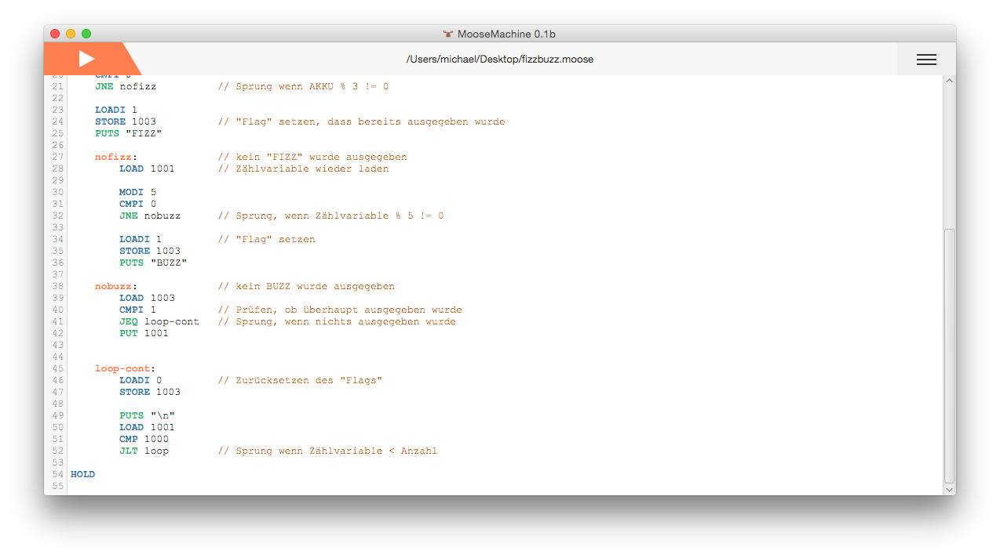

#MooseMachine [](https://travis-ci.org/michaelneu/MooseMachine) [:de:](README-de.md) [:gb:](README.md)

##Motivation
The computer science classes in German grammar schools contain several lessens about the von-Neumann-architecture and ways to program such a machine using the Java application [Minmaschine](http://schule.awiedemann.de/minimaschine.html). It uses a simplified version of a language similar to Assembler and visualizes the processes inside of the CPU. Although the Minimaschine was updated, it still can be crashed by badly written code. The main goal of the MooseMachine is, to fix this and some other problems. 


[](readme/editor.png)

##Features
- Based on JavaFX 8
- All executed code is run in a separate thread to ensure the MooseMachine can't crash due to a `while (true)` loop
- Debugging, including jumping forwards and backwards. The current instruction pointer is visualized in the code view on the right hand of the memory table
- Syntax highlight by using the CodeMirror editor
- Localization: english and german l10n is included, if the system's locale is [missing](src/com/cs/moose/locale/locales), then english is chosen as default. 
- Almost the same syntax as the Minimaschine, although the `DWORD` is missing, the three commands `PUT`, `PUTS` and `PUTA` were added, which allow printing to the stdout
- Huge execution speed boost: A program counting to 2^15 - 1 (max 16 bit integer value) takes about 1.5s on the Minimaschine, the MooseMachine only takes some milliseconds. If used in headless mode, then the MooseMachine takes about 70ms, about 200x faster than the Minimaschine

[](readme/debug.png)

##Writing programs
The syntax of the MooseMachine is equivalent to the [syntax of the Minimaschine](http://schule.awiedemann.de/manualmini/index.html), but is missing the `DWORD` command. You can find a command reference [here](readme/COMMANDS.md). A sample program may look like this:

```
LOADI   100           // load 100 into the accumulator
STORE   100           // and store it in cell 100

PUTS    "number 1: "  // print the string
PUT     100           // print cell 100
PUTS    "\n"
LOADI   200
PUTS    "number 2: "    
PUTA                  // print the accumulator
PUTS    "\n"

ADD     100           // add cell 100 to the accumulator
PUTS    "sum:      "      
PUTA

HOLD                  // stop the machine
```

This program results in following console output:
```
number 1: 100
number 2: 200
sum:      300
```

##Usage in Java
You can use the MooseMachine from Java directly because of the bindings in `com.cs.moose.machine`. A sample program may look like this: 

```java
import java.io.IOException;
import com.cs.moose.exceptions.*;
import com.cs.moose.io.File;
import com.cs.moose.machine.Lexer;
import com.cs.moose.machine.Compiler;
import com.cs.moose.machine.Machine;

public class Main {
    public static void main(String[] args) {
        if (args.length != 2) {
            System.out.println("please include a filename");
            return;
        }

        try {
            String code = File.readAllText(args[1]);
            Lexer lexer = new Lexer(code);                  // run the lexer
            Machine machine = Compiler.getMachine(lexer);   // compile the code to a machine
    
            for (int i = 0; i < 1000; i++) {
                machine.goForward(); // execute
            }
            
            System.out.println(machine.toString(20));                                    // print the first 200 memory cells
            System.out.println("\n\nSTDOUT: \n" + machine.toMachineState().getStdout()); // and the stdout
        } catch (IOException ex) {
            System.out.println("can't read ");
        } catch (SyntaxException ex) {
            System.out.println("syntax error in line " + ex.getLine());
        } catch (CompilerException ex) {
            System.out.println("compiler error: " + ex.getMessage());
        } catch (JumpPointException ex) {
            System.out.println("invalid jump: \"" + ex.getPoint() + "\" is undefined");
        } catch (MachineException ex) {
            System.out.println("error: " + ex.getMessage());
        }
    }
}
```


##License
The MooseMachine is released under the [MIT license](LICENSE.txt). 